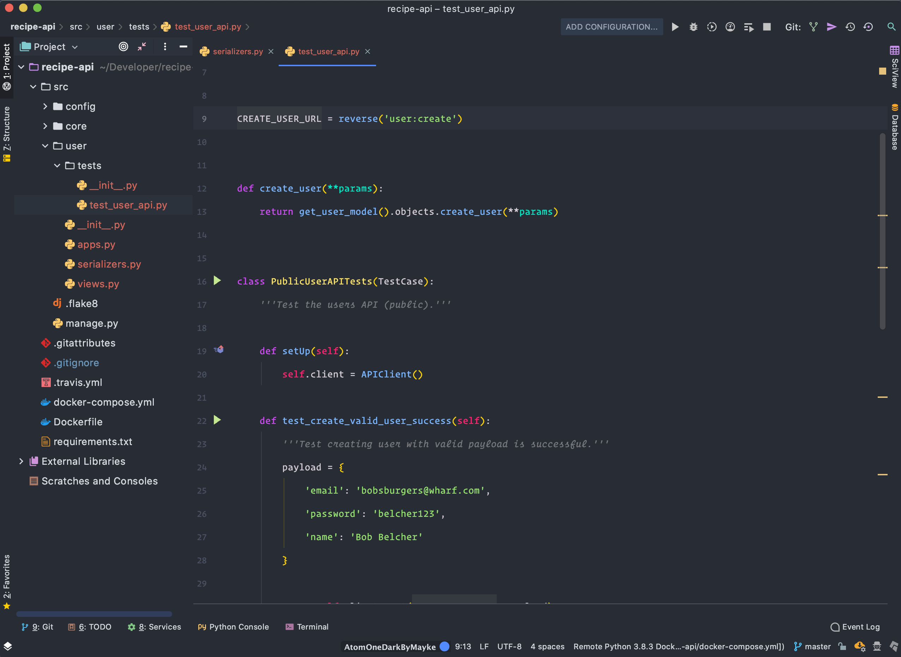

# My PyCharm Settings

Atom One Dark inspire theme for PyCharm IDE.

The UI theme used in the screenshot is the Atom One Dark by [Mayke](https://plugins.jetbrains.com/plugin/13016-atom-one-dark-by-mayke) in combination with the Atom Material Icons by [Elior Boukhobza](https://plugins.jetbrains.com/plugin/10044-atom-material-icons).

If you'd like to use all of my settings (more than just colours) then simply import the `settings.jar` using `File -> Import Settings`. Please note that I mostly code in Python, so my settings will have been optimized for that environment.
